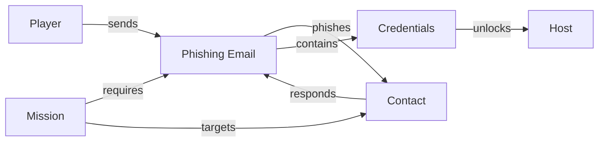

# World Graph Extensibility Analysis

## Current Structure Assessment

### ✅ What Works Well

1. **Modular Entity Definitions**: Each entity is self-contained
2. **Relationship Flexibility**: Easy to add new relationship types
3. **Graph Queries**: Can traverse relationships
4. **Mission Flow**: Clear prerequisite/unlock chain

### ⚠️ Gaps for Future Features

## Scenario: Phishing Email Mission Task

**Example Task**: "Send a phishing email to a Megacorp contact to extract credentials"

### What This Requires

#### 1. New Contact Entity
```typescript
// src/game/world/entities/contacts/megacorp-ceo.ts
export const megacorpCEOContact: Contact = {
  id: 'megacorp-ceo',
  name: 'John Megacorp',
  displayName: 'John Megacorp',
  organizationId: 'megacorp',
  role: 'ceo',
  email: 'john.megacorp@megacorp.com',
  canContactPlayer: false, // Doesn't contact player
  canBeContacted: true,    // NEW: Can receive emails from player
  canBePhished: true,      // NEW: Vulnerable to phishing
  securityAwareness: 'low', // NEW: How likely to fall for phishing
  missionIds: ['n00b-03'],  // Mission involving this contact
};
```

#### 2. Email Sending System
```typescript
// Currently missing:
// - sendEmail command
// - Email composition UI
// - Email templates for phishing
// - Email response system
```

#### 3. New Relationship Types
```typescript
// Current relationships don't cover:
// - Mission → Contact (target for phishing)
// - Player → Contact (sends email)
// - Email → Credentials (extracted from response)
```

#### 4. Credential Extraction
```typescript
// New system needed:
// - Parse email responses
// - Extract credentials from phishing emails
// - Store extracted credentials
```

## Recommended Architecture Improvements

### 1. Extend Contact Type

```typescript
// src/game/world/types/Contact.ts
export interface Contact {
  // ... existing fields
  
  // NEW: Communication capabilities
  canReceiveEmails?: boolean;        // Can player send emails to this contact?
  canBePhished?: boolean;            // Vulnerable to phishing attacks?
  securityAwareness?: 'low' | 'medium' | 'high'; // How security-aware
  responseTime?: number;              // Hours to respond to emails
  responseChance?: number;            // 0-1 probability of responding
  
  // NEW: Relationship tracking
  emailsReceived?: string[];         // Email IDs sent to this contact
  emailsSent?: string[];             // Email IDs sent by this contact
  credentialsExtracted?: string[];   // Credentials extracted from this contact
}
```

### 2. Add Email Sending System

```typescript
// src/game/commands/sendEmailCommand.ts
export const sendEmailCommand: Command = {
  name: 'send',
  aliases: ['sendmail', 'compose'],
  description: 'Send an email to a contact',
  usage: 'send <contact-id> <template-id>',
  execute: async (args: string[]): Promise<CommandResult> => {
    const contactId = args[0];
    const templateId = args[1];
    
    // Validate contact exists and can receive emails
    const contact = worldRegistry.getContact(contactId);
    if (!contact?.canReceiveEmails) {
      return { success: false, error: 'Contact cannot receive emails' };
    }
    
    // Create email from template
    const email = createEmailFromTemplate(templateId, contactId);
    
    // Send email (adds to contact's inbox)
    emailStore.sendEmail(email, contactId);
    
    // Emit event for mission tracking
    eventBus.emit('email:sent', { emailId: email.id, contactId });
    
    return { success: true, output: `Email sent to ${contact.displayName}` };
  },
};
```

### 3. Add Email Response System

```typescript
// src/game/emails/emailResponseSystem.ts
export interface EmailResponse {
  emailId: string;
  contactId: string;
  responseTime: number; // Hours until response
  responseType: 'normal' | 'phishing-success' | 'phishing-failed' | 'ignore';
  extractedCredentials?: {
    username?: string;
    password?: string;
    other?: Record<string, string>;
  };
}

export class EmailResponseSystem {
  /**
   * Process email response based on contact's security awareness
   */
  async processResponse(
    email: Email,
    contact: Contact
  ): Promise<EmailResponse> {
    const responseTime = contact.responseTime || 24; // Default 24 hours
    
    // Determine response type based on email type and contact awareness
    let responseType: EmailResponse['responseType'] = 'normal';
    let extractedCredentials: EmailResponse['extractedCredentials'] = undefined;
    
    if (email.type === 'phishing' && contact.canBePhished) {
      // Calculate success based on security awareness
      const successChance = this.calculatePhishingSuccess(
        contact.securityAwareness,
        email.quality // Email quality/convincingness
      );
      
      if (Math.random() < successChance) {
        responseType = 'phishing-success';
        extractedCredentials = this.extractCredentials(contact, email);
      } else {
        responseType = 'phishing-failed';
      }
    }
    
    return {
      emailId: email.id,
      contactId: contact.id,
      responseTime,
      responseType,
      extractedCredentials,
    };
  }
  
  private calculatePhishingSuccess(
    awareness: Contact['securityAwareness'],
    emailQuality: number
  ): number {
    const baseChance = {
      low: 0.8,
      medium: 0.4,
      high: 0.1,
    };
    
    return baseChance[awareness] * emailQuality;
  }
}
```

### 4. Extend Email Type

```typescript
// src/types/email.ts
export interface Email {
  // ... existing fields
  
  // NEW: Email sending capabilities
  type?: 'normal' | 'phishing' | 'social-engineering';
  to?: string;              // Contact ID receiving email
  from?: string;            // Contact ID sending email (or 'player')
  quality?: number;          // 0-1, how convincing (for phishing)
  templateId?: string;      // Email template used
  
  // NEW: Response tracking
  responseReceived?: boolean;
  responseTime?: number;     // Hours until response
  extractedCredentials?: {
    username?: string;
    password?: string;
    other?: Record<string, string>;
  };
}
```

### 5. Add Phishing Email Templates

```typescript
// src/game/emails/phishingTemplates.ts
export interface PhishingEmailTemplate {
  id: string;
  name: string;
  targetOrganizationId: string;
  targetContactRole?: string; // e.g., 'ceo', 'it-admin'
  quality: number; // 0-1, how convincing
  successChanceModifier: number; // Modifier to base success chance
  extractedCredentials: {
    username?: boolean;
    password?: boolean;
    other?: string[];
  };
  content: (contact: Contact, organization: Organization) => string;
}

export const phishingTemplates: PhishingEmailTemplate[] = [
  {
    id: 'phishing-it-support',
    name: 'IT Support Request',
    targetOrganizationId: 'megacorp',
    targetContactRole: 'it-admin',
    quality: 0.7,
    successChanceModifier: 0.2,
    extractedCredentials: {
      username: true,
      password: true,
    },
    content: (contact, org) => `
Subject: Urgent: IT Support Required

Dear ${contact.name},

We need to verify your account credentials for security purposes.
Please reply with your username and password.

IT Support Team
${org.displayName}
    `,
  },
];
```

### 6. Update Mission Module for Phishing Tasks

```typescript
// src/game/missions/modules/02_03_phishing.ts
export const phishingMissionModule: MissionModule = {
  missionId: 'n00b-03',
  
  mission: {
    // ... mission definition
    tasks: [
      {
        id: 'task-1',
        description: 'Send phishing email to Megacorp CEO',
        type: 'command',
        objective: 'Use "send megacorp-ceo phishing-ceo" to send phishing email',
        hints: [
          'Type "send <contact-id> <template-id>"',
          'The contact ID is "megacorp-ceo"',
          'The template ID is "phishing-ceo"',
        ],
        solution: 'send megacorp-ceo phishing-ceo',
      },
      {
        id: 'task-2',
        description: 'Wait for email response',
        type: 'wait',
        objective: 'Wait 24 hours for the contact to respond',
        hints: [
          'Check your email inbox periodically',
          'Responses take time based on contact',
        ],
        solution: 'mail', // Check email after waiting
      },
      {
        id: 'task-3',
        description: 'Extract credentials from response',
        type: 'command',
        objective: 'Read the response email to extract credentials',
        hints: [
          'Use "mail read <email-id>"',
          'Credentials will be in the response',
        ],
        solution: 'mail read <response-email-id>',
      },
    ],
  },
  
  // NEW: Phishing-specific configuration
  phishingConfig?: {
    targetContactId: 'megacorp-ceo',
    emailTemplateId: 'phishing-ceo',
    requiredTools: ['email-composer'], // Future: tool for crafting emails
  },
  
  // World Graph Relationships
  targetOrganizationIds: ['megacorp'],
  targetHostIds: [], // No direct host targeting
  involvedContactIds: ['megacorp-ceo'], // NEW: Contact targeted for phishing
};
```

### 7. Update Graph Queries

```typescript
// src/game/world/graph/WorldGraph.ts
export class WorldGraph {
  // ... existing methods
  
  /**
   * Get contacts that can be phished
   */
  getPhishableContacts(organizationId?: string): Contact[] {
    let contacts = worldRegistry.getAllContacts();
    
    if (organizationId) {
      contacts = contacts.filter(c => c.organizationId === organizationId);
    }
    
    return contacts.filter(c => c.canBePhished === true);
  }
  
  /**
   * Get contacts that can receive emails
   */
  getContactableContacts(organizationId?: string): Contact[] {
    let contacts = worldRegistry.getAllContacts();
    
    if (organizationId) {
      contacts = contacts.filter(c => c.organizationId === organizationId);
    }
    
    return contacts.filter(c => c.canReceiveEmails === true);
  }
  
  /**
   * Get emails sent to a contact
   */
  getEmailsToContact(contactId: string): Email[] {
    // Query email store for emails where to === contactId
    return emailStore.getAllEmails().filter(e => e.to === contactId);
  }
  
  /**
   * Get credentials extracted from a contact
   */
  getExtractedCredentials(contactId: string): Credential[] {
    const contact = worldRegistry.getContact(contactId);
    return contact?.credentialsExtracted?.map(id => 
      credentialStore.getCredential(id)
    ).filter((c): c is Credential => c !== undefined) || [];
  }
}
```

## Streamlining Recommendations

### 1. Unified Relationship System

**Current**: Different relationship types scattered across entities
**Proposed**: Centralized relationship registry

```typescript
// src/game/world/graph/RelationshipRegistry.ts
export type RelationshipType =
  | 'owns'
  | 'employs'
  | 'targets'
  | 'requires'
  | 'unlocks'
  | 'sells'
  | 'connects'
  | 'sends'
  | 'receives'      // NEW
  | 'phishes'       // NEW
  | 'extracts';     // NEW

export interface Relationship {
  id: string;
  type: RelationshipType;
  from: string;      // Entity ID
  to: string;       // Entity ID
  properties?: Record<string, any>; // Additional metadata
}

export class RelationshipRegistry {
  private relationships: Map<string, Relationship> = new Map();
  
  addRelationship(rel: Relationship): void {
    this.relationships.set(rel.id, rel);
  }
  
  getRelationships(
    from?: string,
    to?: string,
    type?: RelationshipType
  ): Relationship[] {
    // Filter relationships
  }
}
```

### 2. Event-Driven Entity Updates

**Current**: Manual relationship management
**Proposed**: Events automatically update relationships

```typescript
// When email is sent
eventBus.on('email:sent', ({ emailId, contactId }) => {
  relationshipRegistry.addRelationship({
    id: `email-${emailId}-to-contact-${contactId}`,
    type: 'sends',
    from: 'player',
    to: contactId,
    properties: { emailId },
  });
});

// When credentials extracted
eventBus.on('credentials:extracted', ({ contactId, credentialId }) => {
  relationshipRegistry.addRelationship({
    id: `player-extracts-from-${contactId}`,
    type: 'extracts',
    from: 'player',
    to: contactId,
    properties: { credentialId },
  });
});
```

### 3. Template System for Dynamic Content

**Current**: Hardcoded email content
**Proposed**: Template system with variable substitution

```typescript
// src/game/emails/emailTemplateEngine.ts
export class EmailTemplateEngine {
  render(
    template: EmailTemplate,
    context: {
      contact: Contact;
      organization: Organization;
      mission?: Mission;
      player?: PlayerState;
    }
  ): Email {
    // Replace variables in template
    const content = template.content
      .replace('{{contact.name}}', context.contact.name)
      .replace('{{organization.name}}', context.organization.displayName)
      .replace('{{mission.title}}', context.mission?.title || '');
    
    return {
      ...template.baseEmail,
      content,
      to: context.contact.id,
    };
  }
}
```

## Impact Analysis: Adding Phishing Email Task

### Files That Need Changes

1. **Contact Type** (`src/game/world/types/Contact.ts`)
   - Add `canReceiveEmails`, `canBePhished`, `securityAwareness`
   - Add `emailsReceived`, `credentialsExtracted`

2. **Email Type** (`src/types/email.ts`)
   - Add `type`, `to`, `quality`, `extractedCredentials`

3. **Email Store** (`src/game/state/useEmailStore.ts`)
   - Add `sendEmail()` method
   - Add response tracking

4. **Commands** (`src/game/commands/`)
   - Add `sendEmailCommand.ts`

5. **Email Templates** (`src/game/emails/`)
   - Add `phishingTemplates.ts`
   - Add `emailTemplateEngine.ts`

6. **Email Response System** (`src/game/emails/`)
   - Add `emailResponseSystem.ts`

7. **World Graph** (`src/game/world/graph/WorldGraph.ts`)
   - Add phishing-related queries

8. **Mission Event Handlers** (`src/game/missions/missionEventHandlers.ts`)
   - Add handlers for `email:sent`, `credentials:extracted`

### New Entities Needed

1. **Megacorp CEO Contact** (`src/game/world/entities/contacts/megacorp-ceo.ts`)
2. **Phishing Email Templates** (in `phishingTemplates.ts`)
3. **Credential Storage** (new store for extracted credentials)

### Relationship Changes



## Recommendations

### Immediate Improvements

1. **Extend Contact Type** - Add communication capabilities
2. **Add Email Sending** - Basic send command
3. **Add Response System** - Handle email responses
4. **Add Relationship Types** - `sends`, `receives`, `phishes`, `extracts`

### Future-Proofing

1. **Unified Relationship Registry** - Centralize all relationships
2. **Event-Driven Updates** - Auto-update relationships on events
3. **Template Engine** - Dynamic content generation
4. **Credential System** - Store and manage extracted credentials

### Architecture Benefits

- ✅ **Extensible**: Easy to add new contact types, email types, relationships
- ✅ **Flexible**: Can handle various social engineering scenarios
- ✅ **Maintainable**: Clear separation of concerns
- ✅ **Testable**: Each system can be tested independently

## Conclusion

The current graph structure is **solid** but needs **extensions** for advanced features like phishing. The recommended improvements maintain backward compatibility while adding the necessary capabilities.

**Key Insight**: The graph structure itself is fine - we just need to:
1. Extend entity types (Contact, Email)
2. Add new relationship types
3. Add new systems (email sending, response handling)
4. Update graph queries

All changes are **additive** - no breaking changes to existing code.

