# NeonCloud World Graph - Visual Mindmap

This document provides a visual representation of the entire world graph, showing all entities and their relationships.

## Mermaid Diagram

```mermaid
graph TB
    %% Styling
    classDef organization fill:#1a1a2e,stroke:#00ff41,stroke-width:2px,color:#fff
    classDef host fill:#16213e,stroke:#00ffff,stroke-width:2px,color:#fff
    classDef contact fill:#0f3460,stroke:#ffaa00,stroke-width:2px,color:#fff
    classDef mission fill:#533483,stroke:#ff00ff,stroke-width:2px,color:#fff
    classDef tool fill:#1e3a5f,stroke:#00ff88,stroke-width:2px,color:#fff
    classDef email fill:#2d1b3d,stroke:#ff6b9d,stroke-width:2px,color:#fff
    classDef lore fill:#3d2817,stroke:#ffaa00,stroke-width:2px,color:#fff
    
    %% Organizations
    subgraph Organizations["🏢 Organizations"]
        NC[NeonCloud<br/>Special Cyberoperations Group<br/>Type: neoncloud<br/>IP: 10.0.0.0/24]
        MC[Megacorp Industries<br/>Type: corporation<br/>IP: 192.168.1.0/24]
    end
    
    %% Contacts
    subgraph Contacts["👤 Contacts"]
        AS[Agent Smith<br/>Handler<br/>Email: agent-smith@neoncloud-ops.org]
    end
    
    %% Hosts
    subgraph Hosts["🖥️ Hosts"]
        LH[localhost<br/>IP: 127.0.0.1<br/>Role: workstation]
        S01[server-01<br/>IP: 192.168.1.100<br/>Role: web-server<br/>Domain: server-01.megacorp.local]
        S02[server-02<br/>IP: 192.168.1.101<br/>Role: database-server<br/>Domain: server-02.megacorp.local]
    end
    
    %% Missions
    subgraph Missions["📋 Missions"]
        W00[Welcome to NeonCloud<br/>welcome-00<br/>Category: Training]
        TN01[Terminal Navigation<br/>tutorial-01<br/>Category: Training]
        NC02[Network Connectivity<br/>network-02<br/>Category: Training]
        NT03[Network Topology<br/>network-03<br/>Category: Training]
        DE04[DNS Exploration<br/>network-04<br/>Category: Training]
        FH01[First Hack<br/>n00b-01<br/>Category: Script Kiddie]
        DE02[Data Extraction<br/>n00b-02<br/>Category: Script Kiddie]
    end
    
    %% Tools
    subgraph Tools["🔧 Tools"]
        NS[Network Scanner<br/>network-scanner-basic<br/>Vendor: NeonCloud]
        VPN[VPN<br/>vpn-basic<br/>Vendor: NeonCloud]
        PC[Password Cracker<br/>password-cracker-basic<br/>Vendor: NeonCloud]
        LS[Log Shredder<br/>log-shredder-basic<br/>Vendor: NeonCloud]
    end
    
    %% Emails
    subgraph Emails["📧 Emails"]
        E1[Welcome Email<br/>email-welcome-001<br/>From: NeonCloud]
        E2[First Hack Email<br/>email-first-hack-001<br/>From: Contracts]
        E3[Data Extraction Email<br/>email-data-extraction-001<br/>From: Contracts]
    end
    
    %% Lore
    subgraph Lore["📚 Lore"]
        L1[NeonCloud Organization<br/>lore-neoncloud-org]
    end
    
    %% Apply styles
    NC:::organization
    MC:::organization
    AS:::contact
    LH:::host
    S01:::host
    S02:::host
    W00:::mission
    TN01:::mission
    NC02:::mission
    NT03:::mission
    DE04:::mission
    FH01:::mission
    DE02:::mission
    NS:::tool
    VPN:::tool
    PC:::tool
    LS:::tool
    E1:::email
    E2:::email
    E3:::email
    L1:::lore
    
    %% Organization Relationships
    NC -->|owns| LH
    NC -->|employs| AS
    NC -->|sells| NS
    NC -->|sells| VPN
    NC -->|sells| PC
    NC -->|sells| LS
    MC -->|owns| S01
    MC -->|owns| S02
    
    %% Mission Relationships
    W00 -->|targets| NC
    W00 -->|involves| AS
    W00 -->|unlocks| TN01
    W00 -->|unlocks| L1
    W00 -->|requires| NS
    
    TN01 -->|prerequisite| W00
    TN01 -->|unlocks| NC02
    
    NC02 -->|prerequisite| TN01
    NC02 -->|unlocks| NT03
    
    NT03 -->|prerequisite| NC02
    NT03 -->|unlocks| DE04
    
    DE04 -->|prerequisite| NT03
    DE04 -->|unlocks| FH01
    
    FH01 -->|prerequisite| DE04
    FH01 -->|targets| MC
    FH01 -->|targets| S01
    FH01 -->|involves| AS
    FH01 -->|requires| VPN
    FH01 -->|requires| PC
    FH01 -->|unlocks| DE02
    
    DE02 -->|prerequisite| FH01
    DE02 -->|targets| MC
    DE02 -->|targets| S02
    DE02 -->|involves| AS
    DE02 -->|requires| VPN
    DE02 -->|requires| PC
    DE02 -->|requires| LS
    
    %% Email Relationships
    E1 -->|from| AS
    E1 -->|from| NC
    E1 -->|related to| W00
    E1 -->|unlocks| L1
    
    E2 -->|from| AS
    E2 -->|from| NC
    E2 -->|related to| FH01
    E2 -->|mentions| S01
    E2 -->|mentions| MC
    E2 -->|attachment| PC
    
    E3 -->|from| AS
    E3 -->|from| NC
    E3 -->|related to| DE02
    E3 -->|mentions| S02
    E3 -->|mentions| MC
    E3 -->|attachment| PC
    
    %% Network Connections
    S01 -.->|connects| S02
    LH -.->|connects| S01
    LH -.->|connects| S02
    
    %% Tool Unlocks
    NS -->|unlocked by| W00
    VPN -->|unlocked by| FH01
    PC -->|unlocked by| FH01
    LS -->|unlocked by| DE02
    
    %% Mission Email Connections
    W00 -->|sends| E1
    FH01 -->|sends| E2
    DE02 -->|sends| E3
    
    %% Legend
    subgraph Legend["Legend"]
        L_OWN[owns]
        L_EMP[employs]
        L_TGT[targets]
        L_INV[involves]
        L_REQ[requires]
        L_UNL[unlocks]
        L_SEL[sells]
        L_CON[connects]
        L_FRM[from]
        L_MEN[mentions]
        L_ATT[attachment]
    end
    
    style NC fill:#1a1a2e,stroke:#00ff41
    style MC fill:#1a1a2e,stroke:#00ff41
    style AS fill:#0f3460,stroke:#ffaa00
    style LH fill:#16213e,stroke:#00ffff
    style S01 fill:#16213e,stroke:#00ffff
    style S02 fill:#16213e,stroke:#00ffff
```



## Relationship Types

### Organization Relationships
- **owns** → Hosts owned by organization
- **employs** → Contacts working for organization
- **sells** → Tools sold by vendor organization

### Mission Relationships
- **targets** → Organizations/Hosts targeted by mission
- **involves** → Contacts involved in mission
- **requires** → Tools required to complete mission
- **unlocks** → Missions/tools/lore unlocked after completion
- **prerequisite** → Missions that must be completed first
- **sends** → Emails sent when mission starts/completes

### Email Relationships
- **from** → Contact/Organization sending email
- **related to** → Mission this email is part of
- **mentions** → Hosts/Organizations mentioned in email
- **attachment** → Tools/files attached to email

### Network Relationships
- **connects** → Network connections between hosts

### Tool Relationships
- **unlocked by** → Missions that unlock the tool
- **sells** → Vendor organization selling the tool

## Entity Details

### Organizations

#### NeonCloud (neoncloud)
- **Type**: neoncloud (employer)
- **IP Range**: 10.0.0.0/24
- **Owns**: localhost
- **Employs**: Agent Smith
- **Sells**: Network Scanner, VPN, Password Cracker, Log Shredder
- **Missions**: welcome-00, n00b-01, n00b-02

#### Megacorp Industries (megacorp)
- **Type**: corporation (target)
- **IP Range**: 192.168.1.0/24
- **Owns**: server-01, server-02
- **Missions**: n00b-01, n00b-02

### Contacts

#### Agent Smith (agent-smith)
- **Organization**: NeonCloud
- **Role**: Handler
- **Email**: agent-smith@neoncloud-ops.org
- **Missions**: welcome-00, n00b-01, n00b-02

### Hosts

#### localhost
- **Organization**: NeonCloud
- **IP**: 127.0.0.1
- **Role**: workstation
- **File System**: Default local filesystem

#### server-01
- **Organization**: Megacorp
- **IP**: 192.168.1.100
- **Domain**: server-01.megacorp.local
- **Role**: web-server
- **File System**: Linux-style with /home/admin/data/secret.txt
- **Missions**: n00b-01

#### server-02
- **Organization**: Megacorp
- **IP**: 192.168.1.101
- **Domain**: server-02.megacorp.local
- **Role**: database-server
- **File System**: Linux-style with /home/admin/database/
- **Missions**: n00b-02

### Missions

#### Training Missions
1. **Welcome to NeonCloud** (welcome-00)
   - Unlocks: Terminal Navigation, Network Scanner
   - Sends: Welcome Email
   - Unlocks Lore: NeonCloud Organization

2. **Terminal Navigation** (tutorial-01)
   - Prerequisite: welcome-00
   - Unlocks: Network Connectivity

3. **Network Connectivity** (network-02)
   - Prerequisite: tutorial-01
   - Unlocks: Network Topology

4. **Network Topology** (network-03)
   - Prerequisite: network-02
   - Unlocks: DNS Exploration

5. **DNS Exploration** (network-04)
   - Prerequisite: network-03
   - Unlocks: First Hack

#### Script Kiddie Missions
1. **First Hack** (n00b-01)
   - Prerequisite: network-04
   - Targets: Megacorp, server-01
   - Requires: VPN Basic, Password Cracker Basic
   - Unlocks: Data Extraction
   - Sends: First Hack Email

2. **Data Extraction** (n00b-02)
   - Prerequisite: n00b-01
   - Targets: Megacorp, server-02
   - Requires: VPN Basic, Password Cracker Basic, Log Shredder Basic
   - Sends: Data Extraction Email

### Tools

1. **Network Scanner** (network-scanner-basic)
   - Vendor: NeonCloud (free)
   - Unlocked by: welcome-00

2. **VPN** (vpn-basic)
   - Vendor: NeonCloud
   - Unlocked by: n00b-01
   - Required by: n00b-01, n00b-02

3. **Password Cracker** (password-cracker-basic)
   - Vendor: NeonCloud
   - Unlocked by: n00b-01
   - Required by: n00b-01, n00b-02

4. **Log Shredder** (log-shredder-basic)
   - Vendor: NeonCloud
   - Unlocked by: n00b-02
   - Required by: n00b-02

## Graph Statistics

- **Organizations**: 2
- **Contacts**: 1
- **Hosts**: 3
- **Missions**: 7
- **Tools**: 4
- **Emails**: 3
- **Lore Entries**: 1
- **Total Entities**: 21
- **Total Relationships**: ~40+

## Usage

### Viewing the Diagram

1. **GitHub**: The Mermaid diagram will render automatically
2. **VS Code**: Install "Markdown Preview Mermaid Support" extension
3. **Online**: Copy the mermaid code to https://mermaid.live
4. **Local**: Use Mermaid CLI or various markdown viewers

### Modifying the Graph

To add/modify entities:

1. **Add Organization**: Add node in Organizations subgraph, connect with `owns`, `employs`, `sells`
2. **Add Host**: Add node in Hosts subgraph, connect with `owns` from organization
3. **Add Mission**: Add node in Missions subgraph, connect with `targets`, `requires`, `unlocks`
4. **Add Tool**: Add node in Tools subgraph, connect with `sells` from vendor, `unlocked by` from mission
5. **Add Email**: Add node in Emails subgraph, connect with `from`, `related to`, `mentions`

### Relationship Syntax

```mermaid
SOURCE -->|relationship type| TARGET
```

Common relationship types:
- `owns` - Organization owns Host
- `employs` - Organization employs Contact
- `targets` - Mission targets Organization/Host
- `requires` - Mission requires Tool
- `unlocks` - Mission unlocks Mission/Tool/Lore
- `sells` - Vendor sells Tool
- `connects` - Host connects to Host (dotted line)
- `from` - Email from Contact/Organization
- `mentions` - Email mentions Host/Organization

## Export Formats

This mindmap can be exported to:
- **PNG/SVG**: Using Mermaid CLI or online tools
- **GraphML**: For graph analysis tools (Gephi, yEd)
- **JSON**: For programmatic processing
- **CSV**: For spreadsheet analysis

Let me know if you'd like me to generate any of these formats!

